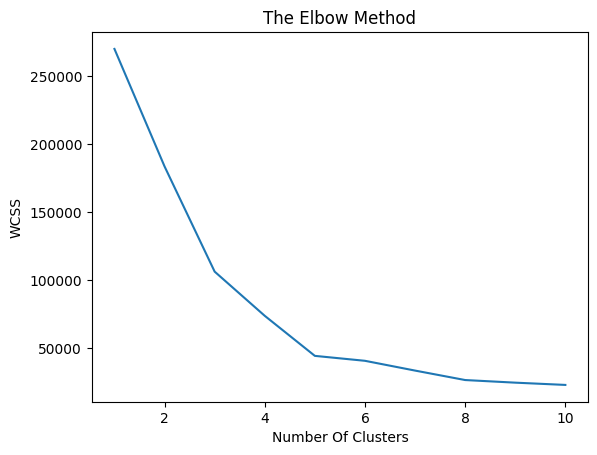
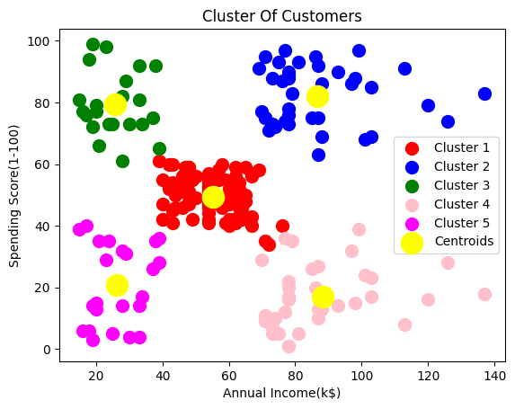

## PRODIGY_ML_02

# 🛍️ Customer Segmentation Using K-Means Clustering

This project was completed as part of the **Machine Learning Internship at Prodigy InfoTech**. The aim is to implement **K-Means Clustering**, an unsupervised machine learning algorithm, to segment retail store customers based on their purchasing behavior.

## 📌 Objective

Segment customers into distinct groups based on:
- Annual Income (k$)
- Spending Score (1–100)

This helps businesses understand customer types for targeted marketing and improved decision-making.

---

## 🧾 Dataset

- 📂 Dataset Name: **Mall_Customers.csv**

---

## 🧠 Key Concepts

- **K-Means Clustering**: Unsupervised algorithm to group similar data points into `k` clusters.
- **Elbow Method**: Technique used to determine the optimal number of clusters.
- **EDA** (Exploratory Data Analysis): Understanding patterns and correlations in the data.
- **Cluster Visualization**: Representing clusters using scatter plots.

---

## 💻 Technologies Used

| Tool/Library   | Purpose                         |
|----------------|----------------------------------|
| Python         | Programming Language             |
| Pandas         | Data manipulation                |
| Matplotlib     | Data Visualization               |
| Scikit-learn   | Machine Learning Algorithms      |

---

## 📊 Steps Followed

1. **Data Loading and Exploration**
   - Loaded `Mall_Customers.csv`
   - Checked for null values and data types

2. **Feature Selection**
   - Selected features:  `Annual Income (k$)`, `Spending Score (1-100)`

3. **Elbow Method**
   - Plotted Within-Cluster Sum of Squares (WCSS) to Number of clusters 

4. **K-Means Clustering**
   - Applied KMeans with optimal `k` ( as 5 in this case)
   - Assigned cluster labels to each customer

5. **Visualization**
   - 2D scatter plot of Annual Income vs Spending Score, colored by cluster
   - Visual interpretation of customer segments

---

## 🔗 Open in Google Colab

## 📈 The Elbow Method Graph

From this graph it is clear that there should a total of 5 Clusters

## 📈 Visualization Example

---

## 🔍 Insights Gained

- Identified groups like:
  - High income, low spenders
  - Low income, high spenders
  - Average income, balanced spenders
---
